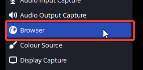
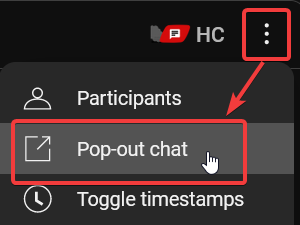
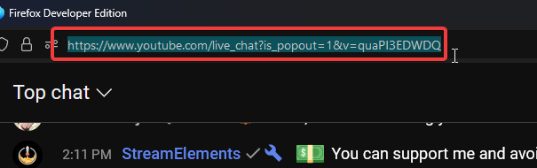
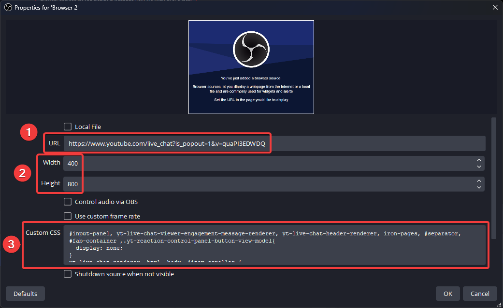
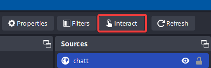

# Custom Style for Youtube Chat in OBS Studio

## Step 1: Create a new browser source 

In a scene, create a new browser source:



## Step 2: Youtube chat URL

Open your stream in your browser, click on the chat popout button and copy the URL.




## Step 3: Enter all the stuff into OBS Studio

In OBS, when creating the browser source, paste the youtube chat URL for the `URL`.

Set `Width` to something like 400. `Height` your choice.

Lastly, copy the CSS from this file [here](yuko-chat.css) into the `Custom CSS` field, delete the default text first.



DONE! :D

# Customization

You can customize the colors yourself in the first paragraph! :D Even change the emote in the background, or provide your own image url.

```css
:root {
  /* to change backgrounds, text color etc, change the hex values here! */
  --chat-message-text-color: #41464d;
  --chat-message-background-color: #e7e7e7;
  --chat-author-viewer-background-color: #41464d;
  --chat-author-member-background-color: #2ba640;
  --chat-author-moderator-background-color: #5e84f1;
  --chat-author-owner-background-color: #ffd600;
  --chat-author-owner-text-color: #41464d;
  ...
}
```

# Caveats

Unfortunately you need to set the URL for every stream, pro tip, just replace the youtube stream ID (the part after the `&v=`) thats all you need.

For *member streams* you need to log in to your OBS browser first. Create a new browser source for `youtube.com` and click `interact` to log in with your youtube account. You might need to copy + paste your credentials.

once done you can delete the browser source, your cookies are shared between different sources.


